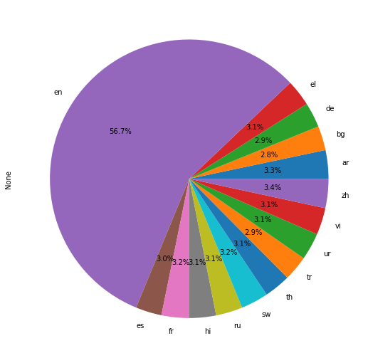

# Contradictory, My Dear Watson

* This repository holds an attempt to use NLI Model with the power of TPU to find the correlation between a premise and a hypothesis with data from the
["Contradictory, My Dear Watson" Kaggle challenge](https://www.kaggle.com/c/contradictory-my-dear-watson). 

## Overview
  * **Definition of the tasks / challenge**  The task, create an NLI model that assigns labels of entailment, neutral, and contradiction to pairs of premises and hypotheses in a multitude of languages as well as explore the use and applications of TPUs.  
  * **Your approach** Ex: The approach in this repository formulates the problem as regression task, using deep recurrent neural networks as the model with the full time series of features as input. We compared the performance of 3 different network architectures.
  * **Summary of the performance achieved** Ex: Our best modelWe were able to predict the next day stoch price within 23%, 90% of the time. At the time of writing, the best performance on Kaggle of this metric is 18%.

## Summary of Workdone

Include only the sections that are relevant an appropriate.

### Data

* Data:
  * Type:
    * Input: Testing CSV File: id → premise → hypothesis→ lang_ab→ language
    * Input: Training CSV File: id → premise → hypothesis → lang_ab → language → label
  * Size: 
    * 4.02 MB
  * Instances:
    * 12120 unique ids

#### Data Visualization

* Percentatges of each language in the training set.  
    
Show a few visualization of the data and say a few words about what you see.

### Problem Formulation

* Define:
  * Input / Output - I receive an ID number, a premise, and a hypothesis and I must determine the relation to the premise and hypothesis.  
  * Models
    * [xlm-roberta-large-xnli](https://huggingface.co/joeddav/xlm-roberta-large-xnli) - Scored 0.92762
    * [bert-base-multilingual-uncased](https://huggingface.co/bert-base-multilingual-uncased) - Scored 0.62906
    * [bert-base-multilungual-cased](https://huggingface.co/bert-base-multilingual-cased) - Scored 0.65158

### Training

  * I trained on Kaggle Notebook because I needed access to TPUs since the basis of the challenge wanted us to use it.
  * Each model took 10 Epochs and it also used relu dense layers
  * I stopped my model by using tf.keras.callbacks.EarlyStopping

### Performance Comparison

* [xlm-roberta-large-xnli](https://huggingface.co/joeddav/xlm-roberta-large-xnli) - Scored 0.92762
* [bert-base-multilingual-uncased](https://huggingface.co/bert-base-multilingual-uncased) - Scored 0.62906
* [bert-base-multilungual-cased](https://huggingface.co/bert-base-multilingual-cased) - Scored 0.65158
* The Best Performing Notebook for this Kaggle challenges is 0.9767.

### Conclusions

* Roberta is a better pre-trained model over bert.

### Future Work

* Now that I am familiar with NLI and using TPUs, I can further look into NLP and how you can find semantic similarities to train a machine to read, hear and then interpret text to give a thoughtful conversation in multiple languages possibly.

## How to reproduce results

* First thing you will want to do is create a Kaggle Notebook and turn on wifi and TPU settings. After this you should import everything you will need for your notebook, I imported numpy, pandas, matplotlib and transformers and keras. Load and then export your training data as well as your test data.
* I would then recommend you spend some time looking at and graphing the data you were given so you have a better understanding of what you are dealing with.
* After you believe you have a grasp of what you are doing, start setting up your TPU, Kaggle has a great tutorial if you are unfamiliar with them.
* After the TPU is set up we will build the model I personally used pretrained models however if you want to build your own you most certainly can. After you built the model fit it and then make the predictions.  
### Overview of files in repository

* WATSON_bert-base-uncased
* WATSON_bert-base-cased
* WATSON_xlm-roberta-large-xnli

### Software Setup
* install Tensorflow, a good website to learn how to do this is simply https://www.tensorflow.org/install
* install Transformers, a good website for that is https://huggingface.co/docs/transformers/installation

### Data

* You can download and view the data used in the [data section](https://www.kaggle.com/competitions/contradictory-my-dear-watson/data) of the challenge website.

#### Performance Evaluation

* To compare each model, I made three different notebooks and submitted each one seperately to Kaggle to compare their scores and performance of the challenge.   

